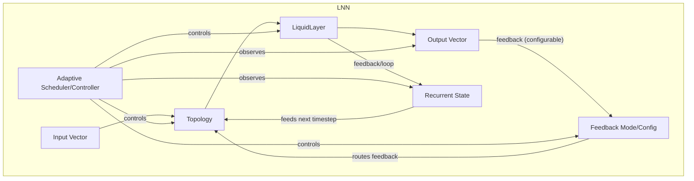
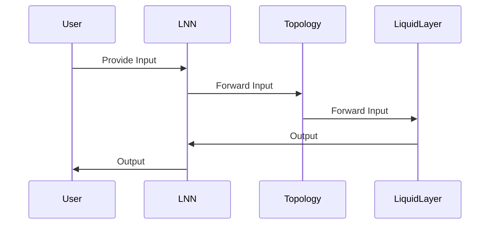
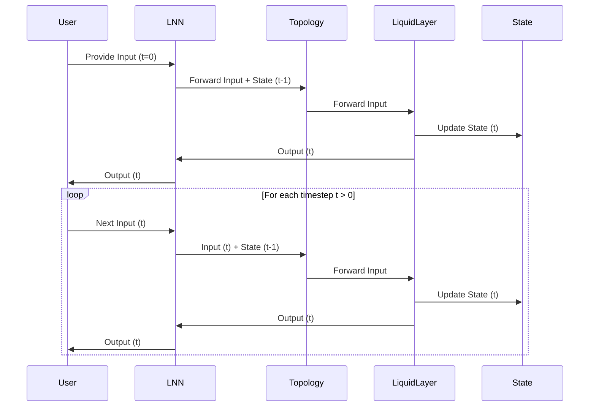
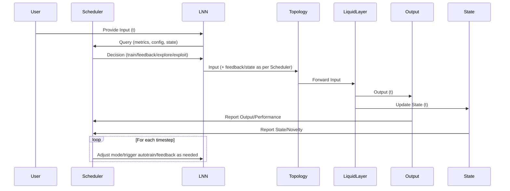

# Liquid Neural Network (LNN) – Recurrent/Loop-Enabled Architecture

## Overview

This document outlines the architecture for enabling recurrent (loop/feedback) connections in the Liquid Neural Network (LNN) in Rust. The design extends the existing modular, feedforward LNN to support feedback pathways, allowing outputs from one timestep to be used as inputs in the next. The architecture supports both feedforward and recurrent operation modes, with clear data flow, state management, and interface changes.

---

## 1. Component Diagram



---

## 2. Data Flow Diagram

### Feedforward Mode



### Recurrent/Loop Mode



### Adaptive Scheduler Logic



---

## 3. Module Structure

- **crates/liquid-core/**
  - `scheduler.rs` (**new**): Implements the adaptive scheduler/controller.
  - `topology.rs`: Exposes hooks for scheduler to trigger training/feedback.
  - `liquid_layer.rs`: Accepts scheduler-driven mode/feedback control.
  - `state.rs`: Provides state/metrics to scheduler.
  - `mod.rs`: Exposes scheduler in public API.
  - `LnnModeConfig`: Extended to allow user configuration of scheduler criteria.

---

## 4. API & Interface Summary

### Scheduler

```rust
pub struct LnnScheduler {
    config: SchedulerConfig,
    metrics: SchedulerMetrics,
    mode: SchedulerMode,
    // ...internal state
}

impl LnnScheduler {
    /// Called at each timestep to decide actions.
    pub fn step(
        &mut self,
        output: &Vec<f32>,
        state: &RecurrentState,
        input: &Vec<f32>,
        user_config: &LnnModeConfig,
    ) -> SchedulerDecision {
        // Analyze metrics, novelty, config, etc.
        // Return decision: train, feedback, explore, exploit, etc.
    }

    /// Update metrics after feedback/training.
    pub fn update_metrics(&mut self, ...);
}
```

### Integration Points

- **Topology/LiquidLayer**: Accepts `SchedulerDecision` to trigger training, feedback, or mode switch.
- **State**: Provides performance, novelty, and history to scheduler.
- **LnnModeConfig**: User can specify scheduler criteria (e.g., thresholds, exploration rate, feedback policy).

---

## 5. Criteria & Decision Logic

- **Performance Metrics**: Loss, accuracy, reward, or user-defined metrics.
- **Input Novelty**: Statistical distance from previous inputs, state change magnitude.
- **User Config**: Explicit triggers, thresholds, exploration/exploitation ratio, feedback policy.
- **Loop/Mode Awareness**: Scheduler adapts logic based on current LNN mode (feedforward, recurrent, feedback-enabled).
- **Autotrain Trigger**: If performance drops, input is novel, or user config requests, scheduler triggers online learning.
- **Exploration vs. Exploitation**: In loop mode, scheduler can stochastically select between trying new actions (explore) or repeating successful ones (exploit), e.g., via epsilon-greedy or softmax policy.

---

## 6. Security & Compliance

- **Thread Safety**: Scheduler maintains no global mutable state; all updates are local and explicit.
- **Data Privacy**: Scheduler operates only on real, user-provided data; no mock or hardcoded data.
- **Safe API**: All interfaces use owned/borrowed references, following Rust safety guarantees.
- **Concurrent Use**: Scheduler is designed for safe use in batched or parallel sequence processing.

---

## 7. Non-Functional Requirements (NFRs)

- **Performance**: Minimal overhead; scheduler logic is lightweight and efficient.
- **Modularity**: Scheduler is encapsulated; LNN can run without it if desired.
- **Extensibility**: Easy to add new criteria, policies, or decision logic.
- **Testability**: Deterministic decisions for given metrics/config; easy to test.
- **Safety**: No unsafe code required.

---

## 8. Assumptions & Tradeoffs

- **Assumptions**:
  - LNN exposes sufficient metrics/state for scheduler decisions.
  - User can configure scheduler via `LnnModeConfig`.
  - All modes (feedforward, recurrent, feedback, autotrain) are compatible with scheduler hooks.

- **Tradeoffs**:
  - Slightly more complex integration, but enables adaptive, data-driven operation.
  - Scheduler logic must be carefully tuned to avoid overfitting or excessive retraining.

---

## 9. Implementation Handoff Summary

- **Create `scheduler.rs`**: Implement `LnnScheduler` with configurable criteria and decision logic.
- **Expose scheduler in public API**: Allow user to enable/disable and configure scheduler.
- **Integrate with Topology/LiquidLayer**: Add hooks for scheduler-driven training/feedback/mode switching.
- **Update `LnnModeConfig`**: Allow user to specify scheduler parameters.
- **Document scheduler usage**: Provide examples for adaptive, feedback-driven, and autotrain-enabled operation.

---

# End of architecture.md
